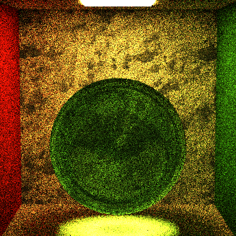

Path Tracer Episode III: Revenge of Fresnel
======================

**University of Pennsylvania, CIS 561: Advanced Computer Graphics, Homework 5**

======================

* Name: Xi Yang
* PennKey: 43486159

======================
Implemented:
------------

SpecularBRDF 
------------
mirrorBox with default settings

SpecularBTDF 
------------
transmitBox with default settings

FresnelDielectric class
------------
glassBall with default settings

glassBall2 with default settings

glassBall2(square root of pixel samples count = 25, recursion limit=5)

Direct Lighting Integrator
------------
CornellBox Naive Integrator

CornellBox Direct Lighting Integrator

MirrorBox Direct Lighting Integrator

GlassBall Direct Lighting Integrator

TransmitBox Direct Lighting Integrator

